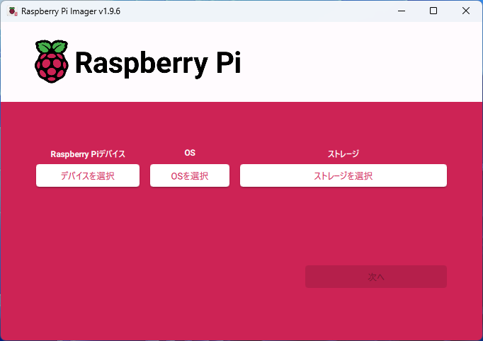
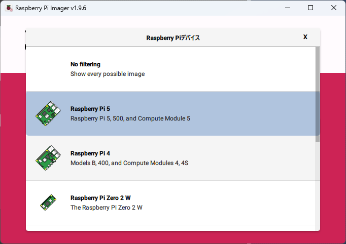
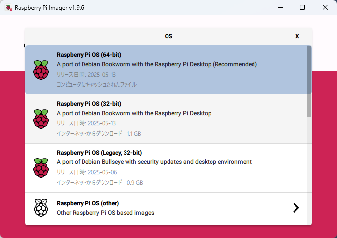
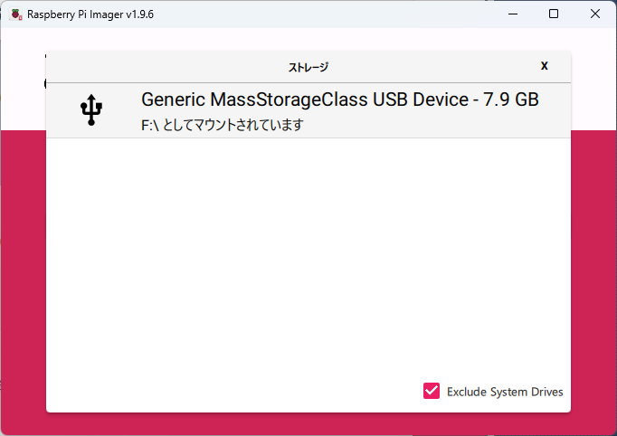
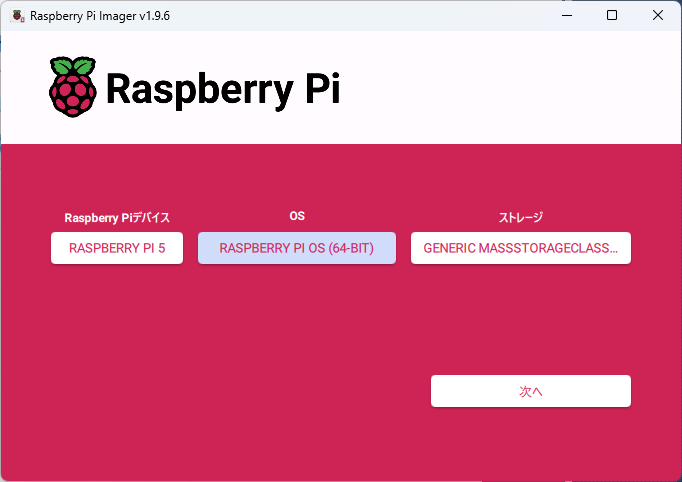
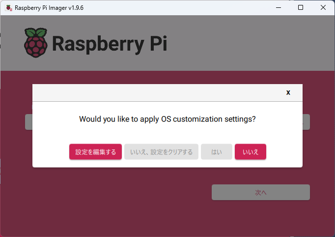
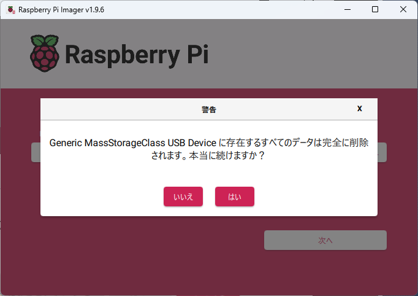
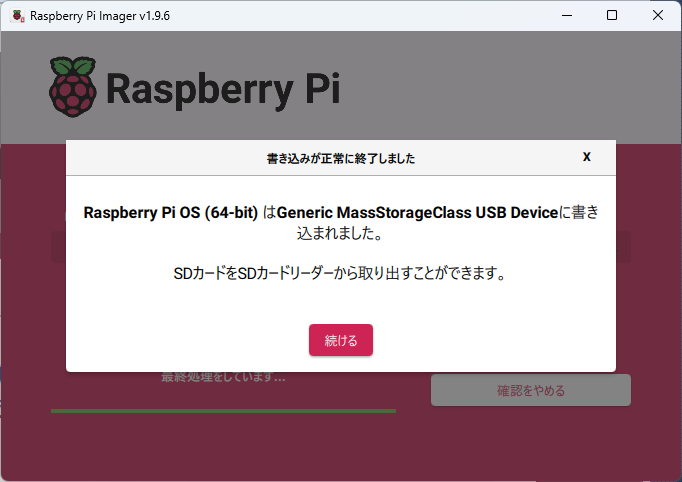

# SDカードの焼きこみ

## raspberry pi imager

[ここ](https://www.raspberrypi.com/software/)からダウンロードする。

## 手順

* imagerを起動する。

* 対象デバイスを選択する。

* OSを選択する。

* 書き込み対象のSDカードを選択する。

* 「次へ」をクリックする。

* 「いいえ」をクリックする。

* 「はい」をクリックする。

* 「書き込み」→「確認」が終了したら、「続ける」をクリックする。

